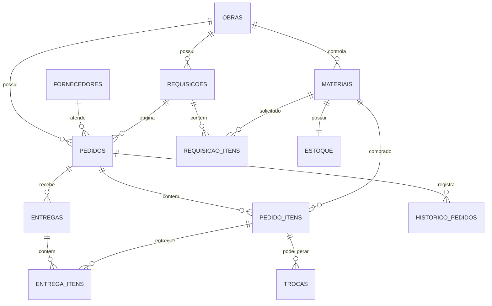

# Arquitetura do Controle de Materiais

## Direção técnica

O sistema será uma aplicação desktop Java 21, executada offline, com JavaFX na interface e SQLite em um arquivo local. O Maven controla as dependências e o ciclo de build. O arquivo de dados será criado em `data/obra.db`, relativo à pasta de execução da aplicação.

```text
JavaFX View
    ↓ eventos e dados de tela
Controller
    ↓ comandos e DTOs
Service
    ↓ regras de negócio e transações
Repository
    ↓ JDBC parametrizado
SQLite
```

Controllers não terão SQL. Services concentrarão validações, mudanças de status, cálculos de prazo e operações transacionais. Repositories farão apenas acesso a dados.

## Pacotes

```text
src/main/java/br/com/pimentech/controlemateriais
├── Main.java
├── controller/       # Controllers JavaFX
├── database/         # DatabaseManager e migrations
├── dto/              # Objetos de entrada e saída
├── exception/        # Exceções de negócio e persistência
├── model/            # Entidades e enums
├── repository/       # Interfaces e implementações JDBC
├── service/          # Casos de uso e regras de negócio
└── util/             # Datas, logs, arquivos e validações

src/main/resources
└── styles/app.css

data/                 # SQLite local
backup/               # Backups escolhidos ou gerados
exports/              # CSV e PDF
logs/                 # application.log
```

## Entidades e relacionamentos



Tabelas principais: `obras`, `materiais`, `fornecedores`, `requisicoes`, `requisicao_itens`, `pedidos`, `pedido_itens`, `entregas`, `entrega_itens`, `trocas`, `historico_pedidos` e `estoque`. Todas terão chave primária; as tabelas filhas terão chaves estrangeiras; datas usarão formato ISO; registros históricos não serão apagados fisicamente.

## Fluxo de status

```text
REQUISIÇÃO → COTAÇÃO → MAPA_COTACAO → APROVADA → COMPRADA
                                      ↓
                              AGUARDANDO_ENTREGA
                                      ↓
                          ENTREGA_PARCIAL → ENTREGA_COMPLETA
                                ↓                  ↓
                           COM_PENDENCIA       CONCLUIDA
```

Uma entrega é uma entidade própria. Um pedido pode ter várias entregas e cada item de entrega registra esperado, recebido, aceito, recusado e motivo. Material recusado não aumenta a quantidade aceita; uma troca fica ligada ao item do pedido e mantém seu próprio ciclo: `SOLICITADA`, `AGUARDANDO_FORNECEDOR`, `ENVIADA`, `EM_TRANSPORTE`, `RECEBIDA` ou `CANCELADA`.

## Persistência e integridade

`DatabaseManager` criará `data/`, abrirá o SQLite com JDBC e executará `PRAGMA foreign_keys = ON`. O versionamento será mantido em `schema_version`. Cada migration será aplicada em ordem dentro de transação e marcada somente após concluir.

Operações que alteram mais de uma tabela usarão uma única conexão e transação. O registro de entrega, por exemplo, salvará entrega, itens, saldos, status e histórico; qualquer falha fará rollback de todo o conjunto.

## Backup

O backup será feito com o banco em estado consistente, usando o mecanismo de backup do SQLite/JDBC quando disponível ou cópia controlada do arquivo com a conexão temporariamente sincronizada. O destino será escolhido por `FileChooser` e o nome sugerido seguirá `backup_yyyy-MM-dd_HHmmss.db`. A restauração exigirá confirmação, criará uma cópia de segurança do arquivo atual e só substituirá o banco após validação do arquivo escolhido.

## Fases de implementação

1. Projeto Maven, JavaFX, SQLite JDBC, JUnit e janela inicial.
2. `DatabaseManager`, migrations, entidades base e repositories JDBC.
3. Obras, materiais e fornecedores.
4. Requisições, itens, cotações e pedidos.
5. Entregas parciais, recusas, pendências e trocas.
6. Dashboard, alertas, histórico e cálculos de prazo.
7. Planejamento de compras e ponto de pedido.
8. Relatórios CSV/PDF, backup e restauração.
9. Testes unitários e de integração, logs e tratamento de erros.
10. Empacotamento com `jpackage` para JAR e instalador Windows.

## Estado atual da implementação

As fases 1 a 5 estão implementadas: projeto Maven, SQLite com migrations, cadastros de obras, materiais e fornecedores, requisições, pedidos, entregas parciais, recusas e trocas.

A fase 6 já possui dashboard com indicadores, alertas e próximas entregas consultados do banco. A fase 7 possui a tela de planejamento com ponto de pedido, dias restantes e situação de compra. A fase 8 possui backup, restauração confirmada e exportação CSV de pedidos e planejamento.

Os testes de integração cobrem criação e persistência do banco, requisição convertida em pedido, entrega parcial com troca e restauração de backup.
